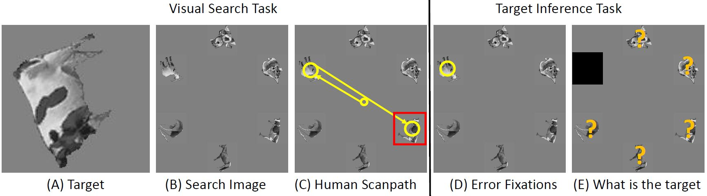

# What am I Searching for: Zero-shot Target Identity Inference in Visual Search

Authors: Mengmi Zhang, and Gabriel Kreiman

This repository contains an implementation of a zero-shot deep learning model for inferring human intentions (what the human subject is searching for) based on fixation patterns. Our paper has been accepted in EPIC-CVPR workshop, 2020.

An unofficial copy of our manuscript is [HERE](https://arxiv.org/abs/2005.12741).

Watch our 5-min presentation [HERE](https://youtu.be/rcWgWTwWDm0).

## Project Description

Can we infer intentions and goals from a person's actions? As an example of this family of problems, we consider here whether it is possible to decipher what a person is searching for by decoding their eye movement behavior. We conducted two human psychophysics experiments on object arrays and natural images where we monitored subjects' eye movements while they were looking for a target object. Using as input the pattern of "error" fixations on non-target objects before the target was found, we developed a model (InferNet) whose goal was to infer what the target was. "Error" fixations share similar features with the sought target. The Infernet model uses a pre-trained 2D convolutional architecture to extract features from the error fixations and computes a 2D similarity map between the error fixation and all locations across the search image by modulating the search image via convolution across layers. InferNet consolidates the modulated response maps across layers via max pooling to keep track of the sub-patterns highly similar to features at error fixations and integrates these maps across all error fixations. InferNet successfully identifies the subject's goal and outperforms all the competitive null models, even without any object-specific training on the inference task. 

[](img/Capture.JPG)

We present an example below. The figure shows the error fixations indicated by yellow number in the visual search process of one human subject (Column 1), the inference maps predicted by our InferNet based on human error fixations (Column 2) and the inferred target location denoted by green numbers (Column 3) from the inference maps. Red color denotes higher probability of being the search target.

[](img/1-teaser.gif)

## Pre-requisite

The code has been successfully tested on Ubuntu 14.04. GPU is highly recommended (6GB GPU memory at least). 

It requires the deep learning platform Torch7. Refer to [link](http://torch.ch/docs/getting-started.html) for installation.  

Matio package is required (save and load matlab arrays from Torch7). Refer to [link](https://github.com/soumith/matio-ffi.torch) for installation.

Loadcaffe package is required (load pre-trained caffe model to Torch7). Refer to [link](https://github.com/szagoruyko/loadcaffe) for installation.

Run the commands:
```
luarocks install image
luarocks install tds
```
Download our repository:
```
git clone https://github.com/kreimanlab/HumanIntentionInferenceZeroShot.git
```

Download the caffe VGG16 model from [HERE](https://drive.google.com/open?id=1AEJse0liaT8uJoLmImqhyJN2y2_6mDsJ) and place it in folder ```/Models/caffevgg16/```

## Datasets

We have collected human eyetracking data in two increasingly complex visual search tasks: object arrays and natural images. You can **download** the complete dataset rom [HERE](https://drive.google.com/file/d/1ZvmugJDds-CrwTvhIXmyYVxnniNmx7ce/view?usp=sharing) (total size: ~7GB). It contains ```Datasets``` folder: search images, targets, ground truth, psychophysics (human eyetracking data, MATLAB function to process and extract fixations).

## Code Usage

Navigate to the repository folder. To pre-process fixation data, extract cropped fixation patches and save them in a folder, run ```preprocessFixation/GenerateFixationPatchObjectArray.m``` for object arrays in MATLAB. One can easily generalize the same processes to natural images by running ```preprocessFixation/GenerateFixationPatchObjectNaturalDesignWaldo.n``` .

To run our InferNet torch7 model (take fixation patches and search images as inputss, output likelihood maps for selected layer in [VGG16](https://arxiv.org/abs/1409.1556)), navigate to ```/torchMM``` and copy the following command in the command window:
```
th MMInferArray.lua
```

Navigate to ```/eval``` folder. Run ```ConsolidateAttentionMapArray.m``` in MATLAB to consolidate likelihood maps across layers and save them in a folder. Run ```ScoreBasedonErrorFixationsArray.m``` to generate final likelihood maps and calculate the number of guesses required given certain number of error fixations. All the evaluation results are saved in ```Mat``` folder. One can skip the steps above and run the following functions to plot the results presented in our paper.

- ```PlotScoreBasedonErrorFixationNumber_cummulative.m```: plot relative improvment performance for all computational models. Toggle ```type``` variable from ```array``` to ```naturaldesign``` for different plots in two datasets respectively.
- ```PlotAblationArray.m```: plot relative improvment performance for all ablated models on object arrays.
- ```PlotQualatativeArray.m```: plot visualization example of final likelihood maps on object arrays.

## Notes

The source code is for illustration purpose only. Path reconfigurations may be needed to run some scripts. We do not provide techinical supports but we would be happy to discuss about SCIENCE!

## License

See [Kreiman lab](http://klab.tch.harvard.edu/code/license_agreement.pdf) for license agreements before downloading and using our source codes and datasets.


